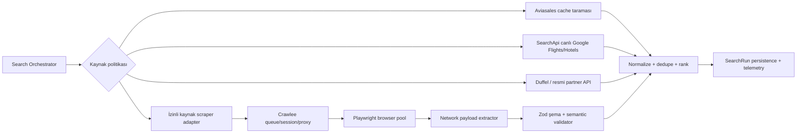

# Uçuş ve otel araması için self-hosted scraper fizibilitesi

**Tarih:** 4 Ağustos 2026  
**İncelenen sistem:** `/Users/savasturkoglu/AI/FlightScanner/src/adapters`  
**Karar kapsamı:** SerpApi/SearchApi benzeri ücretli arama API'lerini Crawl4AI, Playwright, Patchright veya başka bir self-hosted çözümle kısmen ya da tamamen ikame etmek

## Yönetici özeti

**Karar: Tam ikame şu aşamada önerilmiyor; hibrit yaklaşım öneriliyor.**

1. **Kısa vadeli maliyet düşürme:** SerpApi yerine SearchApi için yeni bir adapter yazıp A/B doğrulaması yapmak. Güncel liste fiyatında SerpApi 5.000 arama için aylık $75, SearchApi 10.000 arama için aylık $40'tır. Başlangıç birim maliyeti yaklaşık `$15/1.000` aramadan `$4/1.000` aramaya iner; bu yaklaşık **%73 düşüş** demektir. [SerpApi fiyatları](https://serpapi.com/pricing), [SearchApi fiyatları](https://www.searchapi.io/pricing)
2. **Çağrı sayısını azaltma:** Mevcut ücretsiz/cache'li Aviasales adapter'ını fiyat takip taramasında kullanıp ücretli canlı aramayı yalnız kullanıcı isteğinde veya fiyat düşüşü sinyalinde çalıştırmak; aynı kriterli istekleri kısa süreli cache ve request coalescing ile birleştirmek.
3. **Scraper pilotu:** Yalnız otomatik erişime açıkça izin veren veya yazılı izin alınmış kaynaklarda, Node.js/TypeScript uyumu nedeniyle **Crawlee + Playwright** ile pilot yapmak. Düşük hacimli ilk prototip yalnız Playwright ile de başlayabilir.
4. **Crawl4AI:** Genel web/RAG ve LLM-dostu Markdown üretiminde güçlüdür; deterministik, şeması katı, canlı fiyat odaklı bu kullanım için birinci tercih değildir. Ayrıca Python servisi ve özel atıf yükümlülüğü getirir. Kullanılacaksa, güncel güvenlik düzeltmeleri nedeniyle test edilmiş **v0.9.2 veya daha yeni yamalı bir sürüm** sabitlenmeli ve Docker API internete açık bırakılmamalıdır.
5. **Patchright:** Teknik bir anti-detection seçeneğidir; izin veya hukuki hak sağlamaz. Yalnız izinli hedefte normal Playwright'ın ölçülmüş biçimde engellendiği durumda, değiştirilebilir bir browser-driver arkasında değerlendirilmelidir.

Bu kararın ana nedeni yalnız teknik zorluk değildir. Google'ın güncel koşulları, robot talimatlarına aykırı otomatik erişimi yasaklar; `google.com/robots.txt` de `/travel/search`, `/travel/flights/s/` ve `/travel/flights/search` yollarını disallow eder. Booking.com yazılı izin olmadan robot, scraper veya tarayıcıyla çalışan otomasyon dahil otomatik veri toplamayı açıkça yasaklar. Expedia da robot/scraper ile içerik kopyalamayı, robots kısıtlarını veya erişim önlemlerini aşmayı yasaklar. Doğrudan bu hedeflere üretim scraper'ı kurmak bu yüzden **teknik olarak mümkün, fakat ticari/uyum açısından yüksek risklidir**. Bu bölüm hukuki görüş değildir; üretim öncesi hedef bazında hukuk incelemesi gerekir. [Google Kullanım Şartları](https://policies.google.com/terms?hl=en-US), [Google robots.txt](https://www.google.com/robots.txt), [Booking.com şartları](https://www.booking.com/content/terms.en-us.html), [Expedia şartları](https://www.expedia.com/legal/terms)

## Mevcut sistemden çıkan bulgular

### Adapter yüzeyi

FlightScanner'da arama sağlayıcıları zaten değiştirilebilir sözleşmelerin arkasındadır:

- Uçuş: `FlightSourceAdapter.search(FlightSearchQuery) -> SearchResult`
- Konaklama: `StaySourceAdapter.search(StaySearchQuery) -> StaySearchResult`
- Uçuş sağlayıcıları: SerpApi Google Flights, Duffel, FlightAPI.io, Aviasales Data
- Konaklama sağlayıcısı: SerpApi Google Hotels

Beklenen veri basit bir başlık/fiyat listesi değildir:

- uçuşta tüm yolcular için toplam fiyat, para birimi, segmentler, aktarmalar, süre, kabin, bagaj, token/deep link ve fiyat tazeliği;
- otelde tarih ve misafir sayısına bağlı müsait fiyat, toplam/gecelik fiyat, OTA fiyatları, tesis tipi, puan, konum, iptal koşulu ve deep link.

Bu alanların bir kısmı ilk ekranda veya DOM'da bulunmaz; ikinci seçim/booking isteği, lazy-load veya dahili ağ yanıtı gerekir.

### Geçiş riski şu anda düşük

Mimari haritaya ve import taramasına göre adapter'lar henüz Fastify runtime akışına bağlı değildir; yalnız test scriptlerinden doğrudan çağrılmaktadır. Ortak orchestrator, registry/factory ve dedupe modülü de henüz yoktur. Bu nedenle yeni sağlayıcıyı gerçek kullanıcı akışını bozmadan adapter seviyesinde karşılaştırmak mümkündür.

### Mevcut round-trip doğruluk boşluğu

`serpapi-google-flights.ts` ilk yanıttaki `best_flights + other_flights` kayıtlarını doğrudan normalize ediyor ve `booking_token ?? departure_token` değerini teklif kimliği yapıyor. Oysa Google Flights wrapper dokümantasyonuna göre round-trip aramasında ilk sonuçtan bir `departure_token` seçilip dönüş seçenekleri için ikinci istek yapılmalı; nihai `booking_token` son seçimden sonra oluşur. Mevcut adapter bu ikinci adımı yapmadığı için round-trip kaydında toplam fiyat görünse bile normalize segmentler yalnız gidişi temsil edebilir. Yeni scraper veya SearchApi adapter'ı bu davranışı taklit etmemeli; önce sözleşmenin “gidiş+dönüş itinerary” beklentisi düzeltilmelidir. [SearchApi Google Flights token akışı](https://www.searchapi.io/docs/google-flights-api), [SerpApi Google Flights dokümantasyonu](https://serpapi.com/google-flights-api)

## Seçenek karşılaştırması

| Seçenek | Güçlü taraf | Kritik eksik/risk | Bu proje için rol |
|---|---|---|---|
| **Playwright (Node)** | Mevcut TypeScript stack ile aynı dil; tarayıcı context'leri, proxy, XHR/fetch izleme ve `waitForResponse` ile yapılandırılmış ağ yanıtı yakalama | Queue, session sağlığı, proxy rotasyonu ve autoscaling tarafını bizim yazmamız gerekir; varsayılan kullanım “stealth” değildir | **POC için en sade tercih** |
| **Crawlee + Playwright** | TypeScript; queue, retry, session pool, cookie devamlılığı, proxy rotasyonu, blocked retry ve kaynaklara göre otomatik concurrency | Playwright'a göre daha fazla framework/operasyon yüzeyi; mevcut BullMQ ile sorumluluk sınırı çizilmeli | **İzinli kaynakta üretim için önerilen tercih** |
| **Crawl4AI** | Async browser pool, proxy/session, CSS/XPath JSON extraction, JS çalıştırma, cache, Docker API, Markdown/LLM extraction, anti-bot tespiti ve proxy/fetch fallback | Python servisi gerekir; Markdown/LLM yetenekleri fiyat şeması için gereksiz; dinamik travel RPC'lerini çözme işini ortadan kaldırmaz; public kullanımda özel atıf gerekir; eski Docker sürümlerinde kritik güvenlik açıkları düzeltilmiştir | Genel içerik/RAG için iyi; **bu çekirdek arama için ikinci tercih** |
| **Patchright** | Playwright'a yakın API; bazı CDP/automation sızıntılarını yamalar | Yalnız Chromium; console API kapalı; Playwright testlerinin tamamını geçmediğini ve upstream değişikliklerinde birkaç günlük gecikme olabileceğini proje kendisi belirtiyor; anti-detection uyum riskini çözmez | Yalnız ölçülmüş ve izinli ihtiyaçta **opsiyonel driver** |
| **Doğrudan HTTP/dahili RPC** | Browser'a göre hızlı ve ucuz olabilir | Token/cookie/bootstrap, imza ve şema kolay kırılır; reverse-engineering/şart riski daha yüksek; locale ve deney varyantları | Stabil ve izinli resmi endpoint yoksa önerilmez |
| **Hazır Search API** | Yapılandırılmış JSON, proxy/CAPTCHA/parser bakımı, SLA; yalnız başarılı istek ücretlendirmesi | Aylık değişken maliyet ve sağlayıcı bağımlılığı; downstream veri kullanımı için yine sorumluluk var | **Bugün ana canlı kaynak için en ekonomik düşük riskli yol** |

Playwright tüm HTTP(S), XHR ve `fetch` trafiğini izleyebilir ve belirli ağ yanıtını bekleyebilir. Travel sitelerinde DOM selector'ı yerine doğrulanan yapılandırılmış ağ payload'ını yakalamak, DOM'u yalnız fallback yapmak daha dayanıklıdır. [Playwright network dokümantasyonu](https://playwright.dev/docs/network)

Crawlee; browser pool, otomatik kaynak-temelli concurrency, request retry, proxy/session yönetimi ve kalıcı queue sağlar. JavaScript gerekmeyen izinli hedeflerde kendi dokümantasyonu browser yerine HTTP/Cheerio crawler'ın yaklaşık 10 kat hızlı olabileceğini belirtir. [Crawlee projesi](https://github.com/apify/crawlee), [BrowserCrawler dokümantasyonu](https://crawlee.dev/js/api/3.16/browser-crawler/class/BrowserCrawler), [PlaywrightCrawler seçenekleri](https://crawlee.dev/js/api/playwright-crawler/interface/PlaywrightCrawlerOptions)

Crawl4AI, Playwright tabanlı browser kullanımı, LLM'siz CSS/XPath JSON extraction, session/proxy, çoklu URL dispatcher ve Docker API sunar; fakat projenin ana tasarım odağı web içeriğini temiz Markdown'a ve LLM/RAG girdisine çevirmektir. Lisansı Apache 2.0 metnine ek olarak dağıtım, yayın veya public kullanım için görünür Crawl4AI/UncleCode atfı ister. Resmî README, v0.8.7'de RCE, SSRF, auth bypass, arbitrary file write ve XSS dahil kritik Docker API sorunlarının giderildiğini; v0.9.0'da auth'ın varsayılan açıldığını ve tokensız sunucunun loopback'e bağlandığını; 4 Ağustos 2026 itibarıyla v0.9.2'nin güncel bakım sürümü olduğunu bildirir. Bu nedenle üretimde test edilmiş v0.9.2 veya daha yeni yamalı sürüm/digest sabitlenmeli, API yalnız iç ağda ve domain allowlist ile çalıştırılmalıdır. [Crawl4AI deposu ve sürüm notları](https://github.com/unclecode/crawl4ai), [LLM'siz extraction](https://docs.crawl4ai.com/extraction/no-llm-strategies/), [çoklu URL/concurrency](https://docs.crawl4ai.com/advanced/multi-url-crawling/), [proxy/anti-bot dokümantasyonu](https://docs.crawl4ai.com/advanced/proxy-security/), [lisans](https://raw.githubusercontent.com/unclecode/crawl4ai/main/LICENSE)

Patchright yalnız Chromium'u yamalar; `Runtime.enable`, `Console.enable` ve launch flag sızıntılarını azaltmayı hedefler. Kendi README'si bazı Playwright testlerinin geçmediğini, console işlevinin kapandığını ve upstream değişikliklerinden sonra düzeltmelerin gecikebileceğini açıklar. Bu nedenle doğrudan çekirdek iş mantığına bağımlı edilmemelidir. [Patchright deposu](https://github.com/Kaliiiiiiiiii-Vinyzu/patchright)

Lisans açısından Playwright, Crawlee ve Patchright standart Apache-2.0 lisanslıdır. Crawl4AI'nin `LICENSE` dosyası Apache 2.0 metnine public kullanım ve dağıtım için ek görünür atıf şartı ekler; uyum kontrolünde standart Apache varsayılmamalıdır. Browserless self-host ise SSPL-1.0 veya Browserless Commercial License kullanır ve kapalı kaynak ticari uygulama/CI için ticari lisans istediğini belirtir. [Playwright lisansı](https://raw.githubusercontent.com/microsoft/playwright/main/LICENSE), [Crawlee lisansı](https://github.com/apify/crawlee/blob/master/LICENSE.md), [Patchright lisansı](https://raw.githubusercontent.com/Kaliiiiiiiiii-Vinyzu/patchright/main/LICENSE), [Browserless lisans açıklaması](https://github.com/browserless/browserless)

## Teknik fizibilite

### Google Flights

**Ham sonuç listesini elde etmek:** Orta-yüksek fizibilite.  
**Mevcut sözleşmenin tamamını güvenilir üretmek:** Orta-düşük fizibilite.  
**İzin/uyum:** Yüksek risk; mevcut robots kuralı nedeniyle üretim için no-go.

Zor alanlar:

- round-trip için gidiş seçimi, dönüş seçenekleri ve nihai booking seçenekleri çok adımlıdır;
- fiyat, yolcu/kabin/locale/para birimi ve deney varyantlarına bağlıdır;
- booking seçeneği ve bagaj bilgisi ayrı ağ isteğinde oluşabilir;
- Google tarafındaki dahili payload şeması public sözleşme değildir;
- headless/browser fingerprint, IP reputation, CAPTCHA ve hız sınırı başarı oranını etkiler;
- arama sonucu fiyatı rezervasyon anında değişebilir; tazelik ve canlı doğrulama zorunludur.

### Google Hotels veya doğrudan OTA

**İlk tesis listesini elde etmek:** Orta-yüksek fizibilite.  
**Tarih/misafir bazlı OTA fiyat paritesi:** Orta-düşük fizibilite.  
**İzin/uyum:** Google için yüksek risk; Booking.com için yazılı izin olmadan no-go.

Zor alanlar:

- fiyatlar tesis listesi, property detail ve OTA teklifleri arasında dağılabilir;
- çocuk yaşı, oda kapasitesi, vergi dahil/haric fiyat ve ücretsiz iptal semantiği normalize edilmelidir;
- tatil evi ve otel response'ları aynı şemada tam parite sağlamaz;
- görseller ve deep linkler süreli/redirect tabanlı olabilir;
- doğrudan OTA hedeflemek her site için ayrı parser, izin ve bakım hattı yaratır.

SearchApi'nin resmi Google Hotels dokümantasyonu bile ana arama ve property-detail akışlarını ayrı motorlar olarak sunar; vacation rental OTA fiyat karşılaştırması için ek “expanded search” gerekebilir. Bu, kendi scraper'ında tek sayfa parse etmenin neden yeterli olmayacağının iyi bir göstergesidir. [Google Hotels API](https://www.searchapi.io/docs/google-hotels-api), [Google Hotels Property API](https://www.searchapi.io/docs/google-hotels-property-api)

### Resmî inventory API alternatifleri

Scraper'ın yerini her durumda başka bir SERP wrapper almak zorunda değildir:

- Mevcut **Duffel** adapter'ı, havayollarından dönen teklifleri kullanan Offer Request akışına dayanır ve uçuş arama/rezervasyon hattında korunmalıdır. [Duffel Offer Requests](https://duffel.com/docs/api/v2/offer-requests)
- **Amadeus Flight Offers Search** resmî dokümana göre 500'den fazla havayolunda arama ve sonrasında fiyat doğrulama/booking akışı sağlar; ancak aynı doküman low-cost taşıyıcılar ile American Airlines, Delta ve British Airways içeriğinin bulunmadığını belirtir. Bu yüzden Duffel'ın birebir ikamesi değildir. [Amadeus Flights](https://developers.amadeus.com/self-service/apis-docs/guides/developer-guides/resources/flights/)
- **Booking.com Demand API**, partner kimlik bilgileriyle tarih/misafir bazlı accommodation search, availability, pricing, detail ve redirect veya order akışları sunar. Web sitesini scrape etmek yerine affiliate/partner erişimi araştırılmalıdır. [Booking.com Demand API](https://developers.booking.com/demand/docs/accommodations/about-accommodation), [kimlik doğrulama](https://developers.booking.com/demand/docs/development-guide/authentication)
- **Expedia Rapid Shopping API**, resmî dokümana göre 700.000 konaklamada canlı fiyat ve müsaitlik; oda, iade/iptal ve fiyat kırılımı sunar. Seçilen fiyat booking öncesi Price Check ile yeniden doğrulanır. [Expedia Rapid Shopping API](https://developers.expediagroup.com/rapid/lodging/shopping/about-shopping-api)

Bu API'ler de ticari sözleşme, partner kabulü ve ücret/komisyon gerektirebilir; avantajları undocumented browser payload'ı yerine desteklenen, yapılandırılmış ve booking'e uygun sözleşme sunmalarıdır.

## Hukuki ve operasyonel fizibilite

| Hedef modeli | Teknik | Uyum/ticari | Karar |
|---|---:|---:|---|
| Google Flights/Hotels'i doğrudan scrape etmek | Mümkün ama kırılgan | Google şartları + robots disallow nedeniyle yüksek risk | **Üretimde önerilmez** |
| Booking.com'u izinsiz scrape etmek | Mümkün ama anti-bot maliyetli | Güncel şartlar açıkça yasaklıyor | **No-go** |
| Expedia'yı izinsiz scrape etmek | Mümkün ama anti-bot maliyetli | Güncel şartlar robot/scraper erişimini ve korumaları aşmayı açıkça yasaklıyor | **No-go** |
| Yazılı izinli/affiliate/partner siteyi scrape etmek | Yüksek | Sözleşmeye bağlı yönetilebilir | **Pilot yapılabilir** |
| Resmî Duffel/Booking Demand/Expedia Rapid/bedbank API'leri | Yüksek | Partner kabulü, ücret ve sözleşme gerekir; teknik/uyum riski daha yönetilebilir | **Korunmalı ve genişletilmeli** |
| SearchApi/SerpApi wrapper | Yüksek | Sağlayıcı toplama operasyonunu üstlenir; veriyi kullanım sorumluluğu yine bizde | **Ana/yedek kaynak olarak uygun** |

SearchApi fiyat sayfası, veri toplama/parsing tarafı için belirli bir hukuki koruma sunduğunu; bunun müşterinin veriyi kullanımını veya hukuka aykırı faaliyetleri kapsamadığını açıkça belirtir. Dolayısıyla wrapper kullanmak tüm hukuki riski sıfırlamaz, fakat anti-bot, parser ve toplama operasyonunu dışsallaştırır. [SearchApi fiyat ve kapsam açıklaması](https://www.searchapi.io/pricing)

`robots.txt` tek başına erişim yetkilendirmesi değildir; RFC 9309 bunu açıkça söyler. Ancak hedef sağlayıcı kendi kullanım şartında robot talimatlarına uyumu zorunlu kılabilir. Bu nedenle robots kontrolü gerekli olmakla birlikte, yazılı izin veya sözleşme incelemesinin yerine geçmez. [RFC 9309](https://www.rfc-editor.org/rfc/rfc9309.html)

## Maliyet ve başa baş analizi

### Güncel hazır API maliyeti

| Aylık başarılı arama | SerpApi uygun liste planı | SearchApi uygun liste planı | Fark |
|---:|---:|---:|---:|
| 5.000 | $75 | $40 (10.000 kapasite) | SearchApi $35 daha düşük |
| 10.000 | $150 (15.000 kapasite) | $40 | SearchApi $110 daha düşük |
| 35.000 | $725 (100.000 kapasite) | $100 | SearchApi $625 daha düşük |
| 100.000 | $725 | $250 | SearchApi $475 daha düşük |
| 1.000.000 | $3.750 | $1.500 | SearchApi $2.250 daha düşük |

Planlar kademeli olduğu için tablo, belirtilen hacmi karşılayan en küçük yayınlanmış planı kullanır. Fiyatlar 4 Ağustos 2026 tarihinde görülen liste fiyatlarıdır; satın alma öncesi tekrar kontrol edilmelidir. [SerpApi](https://serpapi.com/pricing), [SearchApi](https://www.searchapi.io/pricing)

### Self-hosted maliyet formülü

Gerçek karşılaştırma yalnız VPS ücretine göre yapılmamalıdır:

```text
C_self = browser compute
       + proxy trafiği
       + CAPTCHA/unblock
       + retry kaynak tüketimi
       + log/metric/snapshot depolama
       + bakım saati × tam yüklü mühendislik maliyeti

Başarılı arama başı maliyet = C_self / doğrulamadan geçen başarılı normalize sonuç
```

Browserless örneğinde bir unit en fazla 30 saniyelik browser bağlantısıdır; yıllık fiyatlamalı $25 planı 20.000 unit içerir, fakat residential proxy 6 unit/MB ve başarılı CAPTCHA 10 unit tüketir. Bu, tarayıcı süresinin ucuz görünmesine rağmen travel sayfalarındaki veri transferi ve unblock maliyetinin hazır Search API birim fiyatını kolayca aşabileceğini gösterir. Bu yalnız piyasa referansıdır; önerilen üretim altyapısı değildir. [Browserless fiyatları](https://cloud.browserless.io/pricing)

### Planlama tahmini

Aşağıdakiler kaynak fiyatı değil, bu kod tabanı ve veri sözleşmesine göre mühendislik tahminidir:

- tek kaynak/tek dikey POC: **2–3 mühendis haftası**;
- uçuş + otel, çok adımlı token akışı, doğrulama ve adapter paritesi: **4–6 hafta**;
- üretim sertleştirme, proxy/session, canary, alert, deploy ve fallback: toplam **8–12 hafta**;
- devam eden parser/anti-bot bakımı: normal ayda **16–40 saat**, büyük hedef değişikliğinde daha fazla.

SearchApi baz alındığında 100.000 arama aylık yalnız $250'dır; bir günlük mühendislik emeği dahi bunun anlamlı bölümünü tüketebilir. Self-hosted yaklaşım genellikle ancak çok yüksek hacimde, hedefe erişim izni mevcutsa, veri stratejik olarak farklıysa ve scraper bakımını yapacak sürekli sahip varsa ekonomik olur. Mevcut sistemde gerçek arama hacmi ve `external_api_usage` telemetrisi henüz runtime'a bağlı olmadığından kesin başa baş noktası hesaplanamaz.

## Önerilen hedef mimari



Sorumluluk sınırları:

- FlightScanner ortak sorgu/sonuç tiplerinin sahibi olarak kalır.
- Yeni self-hosted scraper ayrı servis olacaksa FlightScanner'da yalnız `SelfHostedFlightAdapter` ve `SelfHostedStayAdapter` bulunur.
- Kaynak başına browser workflow ve extractor ayrıdır; normalizasyon ortak değildir.
- DOM selector'ı yerine önce doğrulanan network payload; DOM yalnız kontrollü fallback.
- Her alan Zod ile şekil olarak, ayrıca semantik olarak doğrulanır: pozitif fiyat, beklenen para birimi, tarih sırası, IATA formatı, segment sürekliliği, toplam fiyat tutarlılığı.
- Ham payload/HAR örnekleri kısa süreli ve redact edilmiş tutulur; parser fixture testleri buradan üretilir.
- Scraper hatası boş sonuç gibi gösterilmez: `blocked`, `captcha`, `schema_changed`, `timeout`, `no_inventory` ayrı telemetri olur.
- Circuit breaker başarısız scraper'ı kapatır ve hazır API fallback'ine döner.

Browser servisleri izole container'da, non-root kullanıcıyla, dar egress politikası, CPU/RAM/timeout sınırı ve ephemeral profile ile çalışmalıdır. Playwright'ın resmi Docker dokümanı root çalıştırmanın Chromium sandbox'ını kapattığını ve untrusted siteler için ek kullanıcı/seccomp izolasyonu gerektiğini belirtir. [Playwright Docker](https://playwright.dev/docs/docker)

## Pilot için kabul kriterleri

İzinli bir hedef seçilmeden teknik pilot başlatılmamalıdır. Pilot seçildiğinde başarı “sayfa açıldı” ile değil aşağıdaki ölçütlerle değerlendirilmelidir:

1. En az 30 sorguluk fixture matrisi: one-way/round-trip, direkt/aktarmalı, çoklu havalimanı, dört kabin, yetişkin/çocuk/bebek, üç locale/para birimi; otelde otel/tatil evi, aile, iptal ve fiyat filtresi.
2. Yedi gün boyunca en az 1.000 kontrollü çalıştırmada normalize sonuç başarı oranı **≥ %95**.
3. Block/CAPTCHA oranı **< %2**; retry dahil başarılı arama başı maliyet kaydı.
4. API referansına karşı ilk 20 sonuçta kritik alan doğruluğu: fiyat/para birimi **≥ %99**, segment/tarih/misafir eşleşmesi **%100**.
5. p95 uçuş/otel arama süresi **≤ 30 saniye**; timeout sonrası çalışan fallback.
6. Parser değişikliğini gerçek kullanıcıdan önce yakalayan günlük canary ve `schema_changed` alarmı.
7. Raw response fixture'larıyla adapter contract testleri; round-trip ikinci adım ve booking seçenekleri ayrıca test edilir.
8. Hedefe ilişkin yazılı izin/şart/robots kaydı ve veri saklama politikasının onayı.

## Önerilen uygulama sırası

### Faz 0 — ölçüm ve doğruluk (2–4 gün)

- `external_api_usage` akışını gerçek adapter çağrılarına bağla.
- Aylık sorgu sayısı, aynı kriter tekrar oranı, kaynak başı başarı/latency ve maliyeti ölç.
- Mevcut SerpApi round-trip ikinci istek boşluğunu düzelt veya açıkça “yalnız gidiş seçeneği” olarak modelle.

### Faz 1 — scraper yazmadan tasarruf (3–5 gün)

- `SearchApiGoogleFlightsAdapter` ve `SearchApiGoogleHotelsAdapter` ekle.
- SearchApi alanları SerpApi ile birebir aynı varsayılmamalı; özellikle `flight_type`, `price_per_night/total_price` ve token akışı ayrı map edilmelidir.
- Kayıtlı fixture'larda iki sağlayıcıyı karşılaştır; sonra küçük yüzdeli canlı A/B çalıştır.
- Query hash cache, in-flight request coalescing ve Aviasales sinyal → canlı doğrulama politikasını ekle.

### Faz 2 — izinli scraper POC (2–3 hafta)

- Node/TypeScript içinde plain Playwright ile tek izinli kaynak ve tek dikey.
- Network response keşfi, schema doğrulama, normalize adapter ve fixture testleri.
- Başarı/maliyet ölçülür; LLM extraction kullanılmaz.

### Faz 3 — yalnız eşikler geçilirse üretim (4–8 hafta ek)

- Crawlee session/proxy/retry/autoscaling katmanı.
- İzole browser worker, canary, alert, circuit breaker, provider fallback.
- Patchright yalnız normal Playwright'ın ölçülmüş anti-bot başarısızlığı varsa ve hedef izni bunu kapsıyorsa driver alternatifi olarak denenir.

## Nihai karar

| Karar | Sonuç |
|---|---|
| Crawl4AI ile Google Flights/Hotels'i tamamen ikame | **Önerilmez** |
| Playwright/Patchright ile izinsiz Google/Booking üretim scraping | **No-go** |
| SearchApi adapter'ına geçerek maliyeti hızlı düşürme | **Önerilir; ilk iş** |
| Aviasales cache + canlı doğrulama ile çağrı azaltma | **Önerilir** |
| Yazılı izinli kaynakta Crawlee + Playwright pilotu | **Koşullu önerilir** |
| Resmi/partner API'leri tamamen kaldırma | **Önerilmez; dayanıklı fallback olarak tutulmalı** |

Özetle sorun “hangi crawler daha iyi?” değil, **hangi veri kaynağına hangi hakla, hangi doğruluk ve bakım maliyetiyle erişileceği** problemidir. Bu projede mevcut adapter sınırı doğru kurulmuş; en rasyonel adım onu koruyup sağlayıcı maliyetini düşürmek, çağrıları azaltmak ve yalnız izinli kaynaklarda ölçümlü scraper geliştirmektir.

## Birincil kaynaklar

- [Crawl4AI GitHub deposu](https://github.com/unclecode/crawl4ai)
- [Crawl4AI LLM'siz CSS/XPath extraction](https://docs.crawl4ai.com/extraction/no-llm-strategies/)
- [Crawl4AI concurrency ve rate limiting](https://docs.crawl4ai.com/advanced/multi-url-crawling/)
- [Crawl4AI proxy ve anti-bot dokümantasyonu](https://docs.crawl4ai.com/advanced/proxy-security/)
- [Crawl4AI lisansı ve ek atıf şartı](https://raw.githubusercontent.com/unclecode/crawl4ai/main/LICENSE)
- [Playwright ağ izleme](https://playwright.dev/docs/network)
- [Playwright browser context izolasyonu](https://playwright.dev/docs/browser-contexts)
- [Playwright Docker güvenliği](https://playwright.dev/docs/docker)
- [Playwright lisansı](https://raw.githubusercontent.com/microsoft/playwright/main/LICENSE)
- [Crawlee GitHub deposu](https://github.com/apify/crawlee)
- [Crawlee lisansı](https://github.com/apify/crawlee/blob/master/LICENSE.md)
- [Crawlee BrowserCrawler](https://crawlee.dev/js/api/3.16/browser-crawler/class/BrowserCrawler)
- [Crawlee PlaywrightCrawler seçenekleri](https://crawlee.dev/js/api/playwright-crawler/interface/PlaywrightCrawlerOptions)
- [Patchright GitHub deposu](https://github.com/Kaliiiiiiiiii-Vinyzu/patchright)
- [Patchright lisansı](https://raw.githubusercontent.com/Kaliiiiiiiiii-Vinyzu/patchright/main/LICENSE)
- [Browserless lisans açıklaması](https://github.com/browserless/browserless)
- [Google Kullanım Şartları](https://policies.google.com/terms?hl=en-US)
- [Google robots.txt](https://www.google.com/robots.txt)
- [Booking.com şartları](https://www.booking.com/content/terms.en-us.html)
- [Booking.com Demand API](https://developers.booking.com/demand/docs/accommodations/about-accommodation)
- [Expedia şartları](https://www.expedia.com/legal/terms)
- [Expedia Rapid Shopping API](https://developers.expediagroup.com/rapid/lodging/shopping/about-shopping-api)
- [Duffel Offer Requests](https://duffel.com/docs/api/v2/offer-requests)
- [Amadeus Flight APIs](https://developers.amadeus.com/self-service/apis-docs/guides/developer-guides/resources/flights/)
- [RFC 9309 Robots Exclusion Protocol](https://www.rfc-editor.org/rfc/rfc9309.html)
- [SerpApi fiyatları](https://serpapi.com/pricing)
- [SearchApi fiyatları](https://www.searchapi.io/pricing)
- [SearchApi Google Flights API](https://www.searchapi.io/docs/google-flights-api)
- [SearchApi Google Hotels API](https://www.searchapi.io/docs/google-hotels-api)
- [SearchApi Google Hotels Property API](https://www.searchapi.io/docs/google-hotels-property-api)
- [Browserless fiyatları](https://cloud.browserless.io/pricing)
