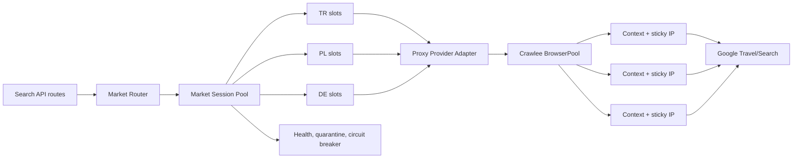

# Çok ülkeli browser ve proxy pool araştırması

**Tarih:** 5 Ağustos 2026  
**Kapsam:** SearchApi içinde Google Flights, Hotels, Vacation Rentals ve genel Google Search isteklerini farklı satış ülkelerinden çalıştırmak

## Yönetici özeti

**Öneri: Her ülke için önceden ayrı bir Chrome process açmayın. Aktif talebe göre oluşturulan, market profiline ve sticky proxy session'ına bağlı browser context slot'ları kullanın.**

Kurulu Crawlee `3.16` ve Playwright `1.59` ile aynı Chrome process'i içinde her incognito context'e farklı `proxyUrl`, `locale`, `timezoneId`, `geolocation` ve permission verilebilir. Bu nedenle ülke başına browser process teknik bir zorunluluk değildir. [Playwright Browser API](https://playwright.dev/docs/api/class-browser), [Playwright emulation](https://playwright.dev/docs/emulation), [Crawlee BrowserPool page options](https://crawlee.dev/js/api/browser-pool/interface/BrowserPoolNewPageOptions)

Bu projede doğru sahiplik birimi ülke değil, **Market Session Slot** olmalıdır:

```text
Market Session Slot
├── marketCountry
├── locale / timezone / geolocation / currency
├── proxy provider session ID
├── sticky exit IP
├── browser context + cookies
├── health/error score
└── bağlı uçuş seçimleri ve son kullanma süresi
```

Bir uçuşun ilk araması, dönüş seçimi ve booking isteği aynı market slot'u, context ve sticky IP üzerinde yürümelidir. Proxy rotasyonu bu zincirin ortasında yapılmamalıdır. Bağımsız yeni aramalar sağlıklı slot'lara dağıtılabilir.

İlk PoC için önerilen sağlayıcı **Decodo rotating residential PAYG**'dir. Resmî belgeleri Google hedeflerini desteklediğini ve session ID ile 1–1440 dakika sticky kullanım sunduğunu açıkça belirtmektedir. İkinci aday Oxylabs'tır; ancak Google Travel domainleri için satın alma öncesi yazılı hedef onayı alınmalıdır. Bright Data'nın standart proxy ürünü Google için ilk tercih olmamalı; kendi dokümantasyonu Google kullanımlarında özel SERP/Browser ürünlerine yönlendirmektedir.

## Doğrulanmış teknik kabiliyetler

### Playwright ve Patchright

Playwright `BrowserContext` oluşturulurken aşağıdaki seçenekleri destekler:

- context'e özel HTTP/SOCKS proxy;
- `locale`, dolayısıyla `navigator.language` ve `Accept-Language`;
- `timezoneId`;
- `geolocation` ve `permissions`;
- cookie ve local/session storage izolasyonu.

Kaynaklar: [Playwright Browser API](https://playwright.dev/docs/api/class-browser), [BrowserContext](https://playwright.dev/docs/api/class-browsercontext), [Emulation](https://playwright.dev/docs/emulation).

Patchright kendisini Playwright için Chromium tabanlı drop-in replacement olarak tanımlar. Patchright kullanmak proxy/session mimarisini değiştirmez; aynı context seçenekleri korunur. Patchright'ın anti-detection yamaları erişim izni sağlamaz ve Google'ın şart/robots kurallarını ortadan kaldırmaz. [Patchright](https://github.com/Kaliiiiiiiiii-Vinyzu/patchright)

### Kurulu Crawlee 3.16 davranışı

Projede `PlaywrightPlugin` şu anda `useIncognitoPages: true` ile çalışıyor. Kurulu Crawlee kaynak kodu:

1. `browserPool.newPage({ proxyUrl, pageOptions })` parametrelerini kabul ediyor;
2. proxy kimlik bilgilerini Playwright `proxy` context option'ına dönüştürüyor;
3. `pageOptions` ile proxy option'ını birleştirip yeni incognito context açıyor;
4. `browserPerProxy` kapalıysa farklı proxy context'lerini kapasitesi olan aynı browser process'inde çalıştırabiliyor.

Yerel doğrulanan dosyalar:

- `node_modules/@crawlee/browser-pool/browser-pool.js`
- `node_modules/@crawlee/browser-pool/playwright/playwright-controller.js`
- `node_modules/@crawlee/browser-pool/abstract-classes/browser-plugin.js`

Crawlee'nin resmî `SessionPool` dokümanı cookie, header, token ve proxy IP gibi kimliklerin aynı session'a bağlı tutulmasını; bloklanan session'ların emekli edilmesini önerir. [Crawlee Session Management](https://crawlee.dev/js/docs/guides/session-management), [Session API](https://crawlee.dev/js/api/3.12/core/class/Session)

## Context mi, browser process mi?

| Model | Avantaj | Dezavantaj | Karar |
|---|---|---|---|
| Her ülkeye her zaman ayrı browser | En güçlü crash/CAPTCHA izolasyonu; persistent profile kolay | Ülke sayısıyla RAM/process sayısı büyür; boş marketler kaynak tüketir | Tüm ülkeler için önerilmez |
| Tek browser, ülke/session başına context | Düşük cold-start ve RAM; Crawlee 3.16 doğrudan destekliyor | Browser crash'i birden fazla marketi etkileyebilir | **MVP için önerilir** |
| Birkaç browser worker, her worker'da context slot'ları | Kapasite ve failure isolation dengesi; yatay ölçeklenebilir | Worker affinity ve routing gerekir | **Üretim için önerilir** |
| Kritik market başına ayrı persistent browser | Cookie/profil devamlılığı ve manuel CAPTCHA çözümü güçlü | Daha yüksek kaynak ve operasyon maliyeti | Yalnız yüksek hacimli/kritik marketlerde |

Başlangıçta `TR`, `PL`, `DE` için birer market slot'u yeterlidir. Bunların aynı Chrome process'inde context olarak çalışması mümkündür. Ölçüm sonucunda CAPTCHA/crash etkisi yüksek çıkarsa yalnız sorunlu veya yüksek hacimli market ayrı browser worker'a taşınmalıdır.

## Önerilen mimari



### `MarketProfile`

```ts
interface MarketProfile {
  country: string;
  locale: string;
  timezoneId: string;
  currency: string;
  geolocation: {
    latitude: number;
    longitude: number;
  };
  proxyPolicy: {
    provider: string;
    pool: "residential" | "isp";
    stickyMinutes: number;
  };
}
```

`currency` market'ten ayrı tutulmalıdır. Örneğin Polonya satış marketinde fiyat PLN yerine EUR gösterilebilir; bu satış ülkesini değiştirmez.

### `MarketSessionSlot`

```ts
interface MarketSessionSlot {
  id: string;
  marketCountry: string;
  proxySessionId: string;
  proxyExitIp?: string;
  state: "starting" | "ready" | "leased" | "quarantined" | "retired";
  createdAt: number;
  lastUsedAt: number;
  expiresAt: number;
  usageCount: number;
  errorScore: number;
}
```

Browser `Page`/`Context` nesnesi yalnız worker memory'sinde tutulur; JSON/Redis'e serialize edilmez.

### Uçuş zinciri affinity kaydı

İstemciye ham Google token'ı tek başına vermek yerine public, rastgele bir selection ID üretmek daha güvenlidir:

```text
publicSelectionId
→ googleSelectionToken
→ marketCountry
→ workerId
→ slotId
→ proxySessionId
→ expiresAt
```

Akış:

1. `/flights` market slot'u lease eder ve selection kaydını slot'a pinler.
2. `/flights/returns` aynı `workerId + slotId` üzerinde çalışır.
3. `/flights/bookings` yine aynı context/IP üzerinde çalışır.
4. Booking tamamlanınca veya 30 dakikalık seçim TTL'i dolunca pin kaldırılır.
5. Slot CAPTCHA/403/429 alırsa zincirin ortasında yeni IP'ye geçirilmez; istek açık hata ile sonlandırılır ve slot quarantine edilir.

Mevcut SearchApi seçim cache'i process-local ve 30 dakikalıktır. MVP'de aynı model genişletilebilir. Birden fazla API instance'ında metadata Redis'te tutulabilir; ancak istek yine context'i taşıyan doğru worker'a yönlendirilmelidir. Bunun için load balancer sticky routing yerine explicit `workerId` routing/queue daha gözlenebilir bir çözümdür.

## Proxy pool davranışı

### Lazy oluşturma

195 ülke için 195 context açılmaz. İlk istek geldiğinde market slot'u oluşturulur:

```text
minimum slots per active market: 1
maximum slots per market: ölçülen talebe göre
global maximum slots: CPU/RAM ve browser limitine göre
idle TTL: örneğin 15–30 dakika
selection pin TTL: mevcut uçuş seçimiyle en az 30 dakika
```

PoC değerleri ölçüm öncesi başlangıç varsayımıdır; production sabiti değildir.

### Sticky session

Sağlayıcıya her request'te rastgele proxy istemek yerine slot başına stabil bir `proxySessionId` üretilir. Proxy URL aynı session ID, ülke ve ürün parametreleriyle tekrar oluşturulmalıdır.

Residential uç cihazın offline olması nedeniyle sağlayıcı 90 dakika söz verse bile IP erken değişebilir. Her yeni lease veya kritik uçuş adımında çıkış IP'si ucuz bir doğrulama endpoint'iyle kontrol edilebilir. IP değişmişse mevcut selection zinciri geçersiz kabul edilmelidir.

### Sağlık ve rotasyon

Hatalar aynı değerlendirilmemelidir:

| Sinyal | Slot davranışı |
|---|---|
| CAPTCHA, 403, 429, Google `/sorry/` | Hemen quarantine/retire |
| Proxy connect/auth hatası | `markBad`, kısa retry; tekrarında retire |
| Google 5xx | Proxy'yi hemen yakma; sınırlı retry |
| Parser/schema değişikliği | Tüm proxy'leri döndürme; parser circuit breaker aç |
| Boş inventory | Başarılı fakat boş iş sonucu; proxy hatası sayma |

Crawlee `SessionPool` `markGood`, `markBad`, `retire` ve blocked status retirement mekanizmalarını sağlar. Ancak uçuş selection affinity'sinin sahibi bizim `MarketSessionPool` katmanı olmalıdır; rastgele Crawlee session seçimine bırakılamaz. [Crawlee SessionPool](https://crawlee.dev/js/api/3.2/core/class/SessionPool)

## Endpoint bazında proxy stratejisi

Tek proxy ürünü bütün endpointler için ekonomik değildir.

| Endpoint | Önerilen yol |
|---|---|
| `/search/web` | Google SERP'e özel proxy/API ile doğrudan HTML/JSON; browser yalnız fallback |
| `/search/flights` → returns → bookings | Sticky residential/ISP browser context ve aynı session/IP |
| `/search/hotels` | Market context; kısa bağımsız aramada slot yeniden kullanılabilir |
| `/search/vacation-rentals` | Hotel ile aynı market pool; ayrı parser/workflow |

Apify Google SERP proxy, ülke ve dil seçerek Google Search HTML'i almak için resmî endpoint sunar. Bu ürün genel web araması için browser bandwidth ve CAPTCHA bakımından daha uygun olabilir; Google Travel RPC desteği varsayılmamalıdır. [Apify Google SERP Proxy](https://docs.apify.com/proxy/google-serp-proxy)

## Sağlayıcı karşılaştırması

Fiyatlar 5 Ağustos 2026 tarihinde görülen liste/PAYG değerleridir; satın alma öncesi tekrar doğrulanmalıdır.

| Sağlayıcı | Geo ve sticky özellikleri | Liste maliyet modeli | Google açısından durum | Değerlendirme |
|---|---|---|---|---|
| **Decodo** | 195+ konum; varsayılan 10 dk, özel session ile 1–1440 dk; eşzamanlı session ID'leri | Residential GB bazlı; PAYG yaklaşık `$4/GB` | Google hedefleri rotating residential ve PAYG için açıkça destekleniyor | **İlk PoC adayı** |
| **Oxylabs** | 195 ülke; country sticky giriş 10 dk, özel/backconnect session seçenekleri | Başlangıç paketi 5 GB / `$30`; daha büyük paketlerde GB düşüyor | Bazı Google domainleri kısıtlı; KYC/hedef onayı gerekebilir | Yazılı domain onayıyla ikinci aday |
| **IPRoyal** | Ülke/şehir/eyalet; 1 sn–7 gün sticky; fair-use altında çoklu session | Residential GB bazlı | Google Travel için açık destek garantisi bulunamadı | Küçük smoke paketi olmadan seçilmemeli |
| **Bright Data** | Geniş geo targeting ve session ID | Residential PAYG normal liste yaklaşık `$8/GB`; kampanyalar değişebilir | Normal proxy ürünlerinde Google kısıtları; SERP/Browser ürünlerine yönlendiriyor | Standart residential ilk tercih değil |
| **Apify** | Proxy username ile country/session; residential ve Google SERP grupları | Residential yaklaşık `$7–8/GB`; SERP yaklaşık `$1.7–2.5/1000` plan seviyesine göre | Genel Search için özel ürün; Travel için ayrıca doğrulama gerekir | `/search/web` için güçlü aday |

Birincil kaynaklar:

- [Decodo sticky sessions](https://help.decodo.com/docs/residential-proxy-custom-sticky-sessions)
- [Decodo Google erişim politikası](https://decodo.com/faq/general/do-you-have-any-blocked-sites)
- [Decodo residential fiyatları](https://decodo.com/proxies/residential-proxies)
- [Oxylabs sticky proxy entry nodes](https://developers.oxylabs.io/proxies/residential-proxies/session-control/sticky-proxy-entry-nodes)
- [Oxylabs residential fiyatları ve kısıt uyarısı](https://oxylabs.io/pricing/residential-proxy-pool)
- [IPRoyal residential kullanım](https://help.iproyal.com/en/articles/7214673-how-to-use-residential-proxies)
- [IPRoyal session eşzamanlılığı](https://help.iproyal.com/en/articles/7222629-how-many-sessions-can-i-use-at-once)
- [Bright Data residential yapılandırma](https://docs.brightdata.com/proxy-networks/residential/configure-your-proxy)
- [Bright Data proxy FAQ](https://docs.brightdata.com/proxy-networks/faqs)
- [Bright Data residential fiyatları](https://brightdata.com/pricing/proxy-network/residential-proxies)
- [Apify Proxy](https://docs.apify.com/proxy)
- [Apify fiyatları](https://apify.com/pricing)

### Sağlayıcı seçerken zorunlu satın alma soruları

Teknik PoC'den önce sağlayıcıdan yazılı cevap alınmalıdır:

1. `google.com/travel/flights`, `google.com/travel/search` ve ilgili batchexecute/RPC yollarına izin var mı?
2. Ülke hedeflemesi gerçek exit peer ülkesini garanti ediyor mu?
3. Sticky session maksimum ve idle TTL nedir?
4. Residential cihaz offline olursa aynı session ID yeni IP'ye sessizce geçer mi, yoksa hata mı verir?
5. Browser HTTPS trafiği ve uzun bağlantılar destekleniyor mu?
6. CAPTCHA/unblock ayrı ücretleniyor mu?
7. KYC, domain allowlist veya use-case approval gerekiyor mu?
8. Trafik ölçümü request+response header/body'nin tamamını kapsıyor mu?

## Maliyet modeli

Residential proxy maliyeti arama adediyle değil trafik ve retry ile oluşur:

```text
aylık proxy maliyeti
= başarılı arama sayısı
 × ortalama GB / deneme
 × deneme / başarılı arama
 × sağlayıcı $ / GB
```

Ölçülmeden sabit “arama başı” maliyet varsayılmamalıdır. PoC şu metrikleri ayrı kaydetmelidir:

- endpoint ve market bazında browser'ın toplam upload/download byte'ı;
- ilk deneme ve retry sayısı;
- CAPTCHA/block oranı;
- proxy connect ve target response latency;
- arama → return → booking zincirinin toplam MB'ı;
- context cold-start ve tekrar kullanım farkı.

Genel Google Search için özel SERP ürünleri request başı fiyatlandığı için bandwidth tabanlı browser proxy'sinden daha öngörülebilir olabilir.

## Güvenlik ve operasyon

- Proxy kullanıcı adı/parolası request, log, capture veya response'a yazılmamalıdır.
- Sağlayıcı credentials bir secret store/env referansından `ProxyProviderAdapter` içinde URL'ye eklenmelidir.
- Mevcut capture redaction proxy authorization alanlarını da kapsayacak şekilde test edilmelidir.
- Response'a yalnız `marketCountry`, provider adı ve anonim slot/session kimliği konabilir; proxy URL/IP varsayılan olarak müşteriye verilmemelidir.
- Ülke başına concurrency, global browser concurrency ve günlük GB/spend limitleri ayrı circuit breaker'larla sınırlandırılmalıdır.
- Google'ın güncel şartları, makinece okunabilir talimatlara aykırı otomatik erişimi yasaklar. Proxy teknik erişim sağlar; hukuki/ticari izin sağlamaz. Üretim öncesinde hedef kullanım, robots ve sözleşme incelemesi gereklidir. [Google Terms](https://policies.google.com/terms?hl=en-US)

## PoC planı

### Faz 1 — tek sağlayıcı, üç market

Decodo PAYG üzerinde `TR`, `PL`, `DE`:

- her market için 1 lazy context slot;
- 90 dakikalık sticky session;
- locale/timezone/geolocation/currency eşlemesi;
- aynı test matrisiyle uçuş, dönüş, booking, hotel ve web araması;
- gerçek exit IP, fiyat, partner listesi, CAPTCHA, latency ve MB ölçümü.

### Faz 2 — pool ve sağlık

- `MarketProfileRegistry`;
- `ProxyProviderAdapter`;
- `MarketSessionPool` lease/pin/release;
- slot health score, quarantine ve circuit breaker;
- selection ID → market/worker/slot affinity;
- credentials redaction testleri.

### Faz 3 — üretim ölçeği

- browser worker process/container'ları;
- worker başına sınırlı context slot'u;
- Redis metadata ve explicit worker routing;
- yüksek hacimli marketler için ayrı worker;
- hazır Search API/resmî partner API fallback'i;
- provider bazlı harcama limiti ve canary.

## Nihai karar

1. **Her ülke için sürekli browser açmayın.** Aktif markete göre lazy context slot'u açın.
2. **MVP'de tek Crawlee BrowserPool + market başına context** kullanın.
3. **Üretimde birkaç browser worker'a shard edin;** yalnız yüksek hacimli veya sorunlu marketleri ayrı process'e ayırın.
4. **Uçuş seçim zincirini aynı context ve sticky IP'ye pinleyin.** Rastgele proxy rotasyonu yalnız yeni bağımsız aramalar arasında yapılabilir.
5. **İlk PoC sağlayıcısı Decodo PAYG olsun;** Oxylabs yazılı Google Travel onayıyla yedek adaydır.
6. **Genel Google Search için browser proxy yerine özel SERP ürününü ayrıca değerlendirin.**
7. **Maliyeti önce trafik ve başarı telemetrisiyle ölçün;** sağlayıcı seçimini liste fiyatına bakarak kesinleştirmeyin.

